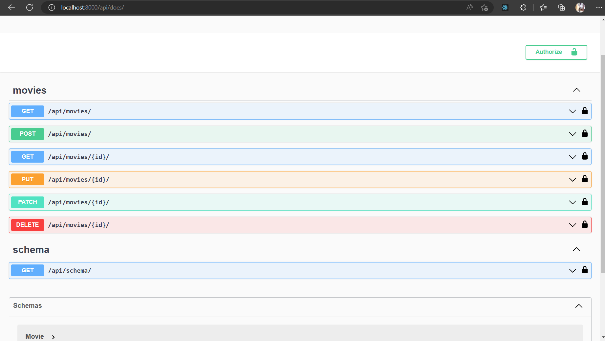
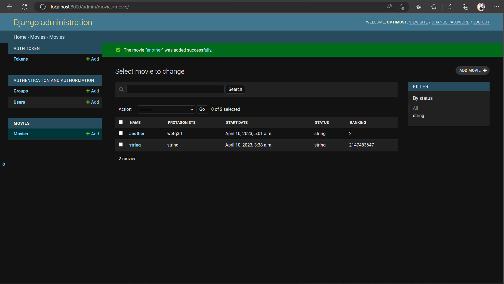

# cinema_program
A test Project

This is an API for managing a cinema program, with the ability to add new movies, sync the data to MongoDB, and list trending movies sorted by ranking

## Requirements

- Docker
- Docker Compose

## Stack

- Django
- Django REST Framework
- Postgres
- MongoDB
- Celery
- Redis
- RabbitMQ

## Getting Started

1. Clone the repository:

    git clone https://github.com/<your-github-username>/cinema-program.git

2. Move into the project directory:

    cd cinema-program-api

3. Run the following commands to build and start the containers:

   - docker build .
   - docker-compose build
   - docker-compose up 

4. Run the tests:
   docker-compose run --rm app sh -c "python manage.py test"

5. Access the API at http://localhost:8000/api/docs/

## API Endpoints

# Movies
- GET /api/movies/ - List all movies
- POST /api/movies/ - Create a new movie
- GET /api/movies/{id}/ - Retrieve a movie by ID
- PUT /api/movies/{id}/ - Update a movie by ID
- PATCH /api/movies/{id}/ - Update a movie by ID
- DELETE /api/movies/{id}/ - Delete a movie by ID

## Development
- Run the following command to start the development server:
  docker-compose up 
- The development server can be accessed at http://localhost:8000/
- Run the following command to create a new Django project:
    docker-compose run --rm app sh -c "django-admin startproject myproject"
- Run the following command to create a new Django app after creating your project:
    docker-compose run --rm app sh -c "python manage.py startapp <app_name>"

